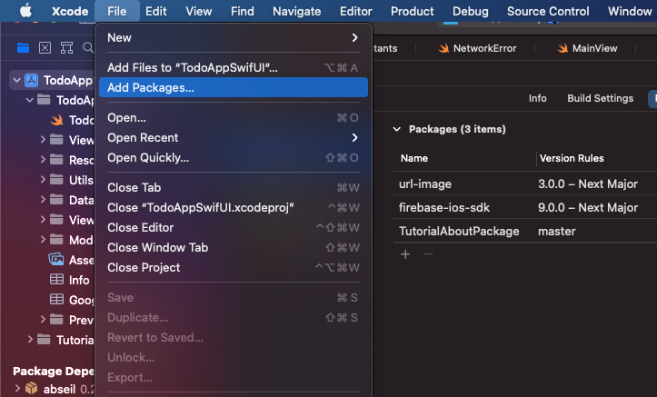
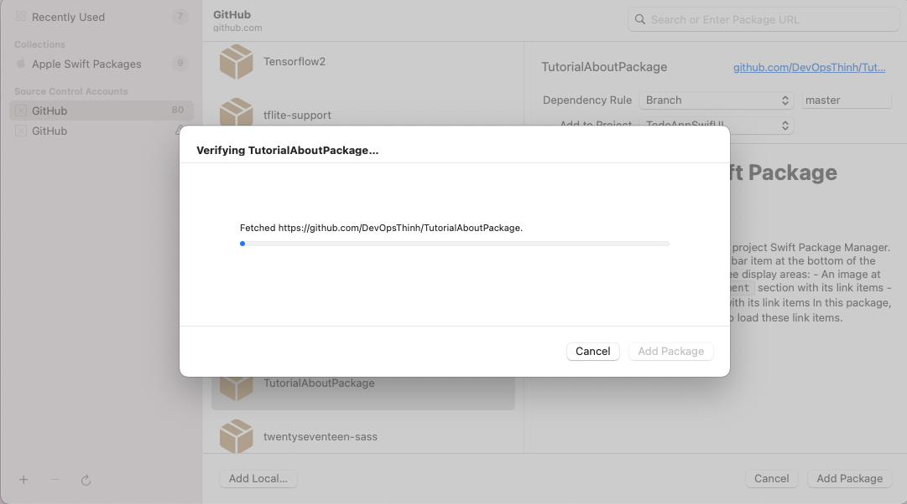
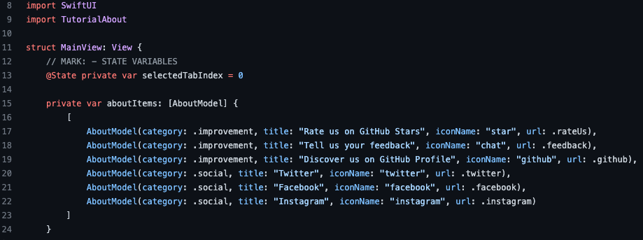
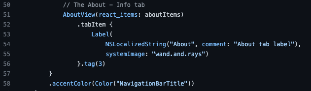

# TutorialAbout Swift Package

## Introduction :wave:
A Swift package use the open-source project Swift Package Manager.
It's for we will integrate the About tab bar item at the bottom of the screen.
The About screen have to three display areas:
    - An image at the top of the screen
    - The `improvement` section with its link items
    - The `connecting with us` section with its link items
In this package, we have use SFSafariViewController to load these link items.

## Installation :cook:   
    - `Integrating`:
     
     
    - `Consuming`:
     
    
    
## Improve us :handshake:
<strong><em>:star: Please give me a STAR! :star:<em><strong>
